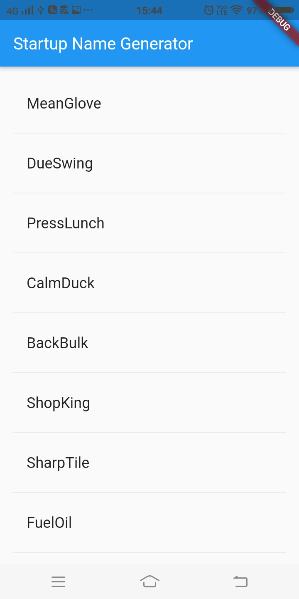

# Startup Namer
A simple app that I made by following [this](https://flutter.dev/docs/get-started/codelab) tutorial from the official flutter docs.  

The App is pretty simple, it lazy loads (loads more items as you scroll), a list of random word pairs, that could be useful in naming your e p i c startup!

## Screenshot of the App
